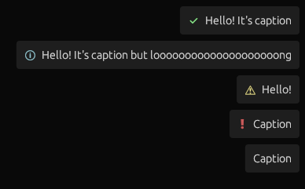

# egui-notify
Simple notifications library for [`egui`](https://github.com/emilk/egui)




# Usage
```rust
use egui_notify::Toasts;
use std::time::Duration;

// initialize once
let mut toasts = Toasts::default();
```
```rust
// somewhere within [egui::App::update]...
toasts.info("Hello world!").set_duration(Duration::from_secs(5));
// ...
toasts.show(ctx);
```

# Installation
```toml
[dependencies]
egui-notify = "0.3"
```

# Difference to [`egui-toast`](https://github.com/urholaukkarinen/egui-toast)
###  `egui-notify` has
 - Animations for appearing/disappearing toasts
 - Duration meter for expiring toasts
 - Toast positioning not influenced by which `Context` you pass to it (like if for example, you passed in a `Context` already altered for an `egui::Window`)
 - Differing methodology (create `Toasts` instance once, save save somewhere in application state)
 - No support for custom toasts
